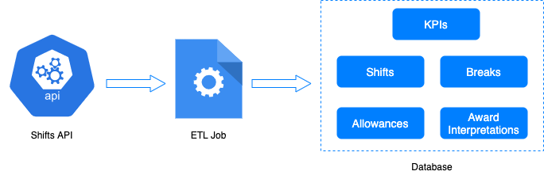

# Shifts ETL

This project implements an **ETL (Extract, Transform, Load)** job designed to consume shift data from an API endpoint, perform the required transformations, and store the results in a PostgreSQL database.

<p align="center">
    
</p>

## Approach

The ETL process was designed to scale beyond a small number of records (e.g., 360), and the following considerations were made:

- Keeping all records in memory, using a single database transaction for all inserts, or relying on an Object-Relational Mapper (ORM) were avoided.
  
### Key Steps in the ETL Process:
1. **Extract**: Data is fetched by calling the provided API endpoint.
2. **Transform**: The returned JSON data is processed to generate separate lists of dictionaries for shifts, breaks, allowances, and award interpretations.
3. **Data Augmentation**: Nested records (e.g., breaks, allowances) are assigned an additional column representing the `shift_id` of the parent shift.
4. **Timestamp Conversion**: Timestamps in milliseconds are converted to seconds and parsed as timestamps.
5. **Shift Cost Calculation**: The shift cost is computed during transformation.
6. **Data Mapping**: A function maps the dictionary keys to database column names to ensure better fault tolerance.
7. **Bulk Insert**: For each list (shifts, breaks, allowances, etc.), a bulk insert is performed by transforming the data into a list of arranged tuples.
8. **Transaction Management**: Inserts are done within a database transaction. If an insert fails, all data in the batch is rolled back to maintain data integrity.
9. **Pagination Handling**: If the API response provides a `next` URL, the ETL job fetches the next batch of data and repeats steps 1-8 until no further data is available.
10. **KPI Calculation**: Once all data is inserted, Key Performance Indicators (KPIs) are computed using an SQL query to avoid excessive memory usage.

### SQL query for KPIs:
```sql
INSERT INTO kpis (kpi_name, kpi_date, kpi_value)
            VALUES
                (
                    'mean_break_length_in_minutes', 
                    CURRENT_DATE, 
                    (SELECT COALESCE(EXTRACT(EPOCH FROM AVG(break_finish - break_start)) / 60, 0) FROM breaks)
                ),
                (
                    'mean_shift_cost',
                    CURRENT_DATE,
                    (SELECT COALESCE(AVG(shift_cost), 0) FROM shifts)
                ),
                (
                    'max_allowance_cost_14d',
                    CURRENT_DATE,
                    (
                        SELECT COALESCE(MAX(allowance_cost), 0) 
                        FROM allowances 
                        INNER JOIN shifts ON allowances.shift_id = shifts.shift_id 
                        WHERE shift_date >= CURRENT_DATE - INTERVAL '14 days'
                    )
                ),
                (
                    'max_break_free_shift_period_in_days',
                    CURRENT_DATE,
                    (
                        WITH grps AS (
                            SELECT shifts.shift_id, break_id, shift_date,
                                SUM(CASE WHEN break_id IS NULL THEN 0 ELSE 1 END) OVER(ORDER BY shift_date) AS grp
                            FROM shifts
                            LEFT JOIN breaks ON shifts.shift_id = breaks.shift_id
                        )
                        SELECT COALESCE(
                            COUNT(*) - CASE WHEN grp = 0 THEN 0 ELSE 1 END, 
                            0
                        ) AS cnt
                        FROM grps
                        GROUP BY grp
                        ORDER BY cnt DESC 
                        LIMIT 1
                    )
                ),
                (
                    'min_shift_length_in_hours',
                    CURRENT_DATE,
                    (SELECT COALESCE(MIN(EXTRACT(EPOCH FROM (shift_finish - shift_start)) / 3600), 0) FROM shifts)
                ),
                (
                    'total_number_of_paid_breaks',
                    CURRENT_DATE,
                    (SELECT COALESCE(COUNT(*), 0) FROM breaks WHERE is_paid = true)
                );
```

### Explanation of KPI Calculation:
1. **Basic Aggregations**: Most KPIs are derived using simple SQL aggregate queries.
2. **'max_break_free_shift_period_in_days'**: This KPI is calculated using a more complex SQL query:
    - A **LEFT JOIN** is performed between shifts and breaks, resulting in `NULL` values for missing breaks.
    - A **window function** is used to group shifts by consecutive periods without breaks.
    - The largest group represents the longest break-free shift period, but it must be adjusted by removing 1, as every group starts with a single break record (except group 0 if it exists).

## How to Run

The ETL job has been integrated into a Docker Compose setup, so the entire system can be launched with:

```bash
docker-compose up --build
```

The ETL application will be accessible at [http://localhost:8080](http://localhost:8080) and provides the following POST endpoints:

1. **Run ETL**: Executes the entire ETL job, with an optional `batch_size` query parameter between 1 and 30:
   - Example: [POST] [http://localhost:8080/run-etl?batch_size=30](http://localhost:8080/run-etl?batch_size=30)
   
2. **Clear Data**: Clears all inserted data from the database:
   - [POST] [http://localhost:8080/clear-data](http://localhost:8080/clear-data)

The configuration for the database and API base URL are read from environmental variables in the `docker-compose.yaml` file.

**Note**: PostgreSQL runs on port 5433 in this setup to avoid conflicts with any existing local PostgreSQL instances.

## Tests

Three tests have been implemented to validate different aspects of the ETL process:
1. **Basic Test**: Verifies fetching, processing, and inserting data for a single API response.
2. **Pagination Test**: Simulates the loading of multiple pages of API data.
3. **Rollback Test**: Assesses whether inserts within a batch are rolled back when an error occurs.

To run the tests, create a test database (configured as `test_db`) and run:

```bash
python -m unittest tests/test_shift_data_processor.py
```


## Additional Considerations

This project was designed for a straightforward use case that involves ingesting all data from the provided API into the configured database. As a result, handling scenarios such as inserting records that may already exist (e.g., in repeated runs) is currently not implemented. To extend the project for more complex use cases, modifications would be necessary.

For handling very large datasets, an alternative approach could involve appending records to separate CSV files. These files could then be imported into the database using the `COPY` command, which is significantly faster than `INSERT` statements, as it reduces the overhead associated with logging and parsing. However, this approach was avoided in this project to keep things simple, as it introduces unnecessary complexity for the current requirements.
